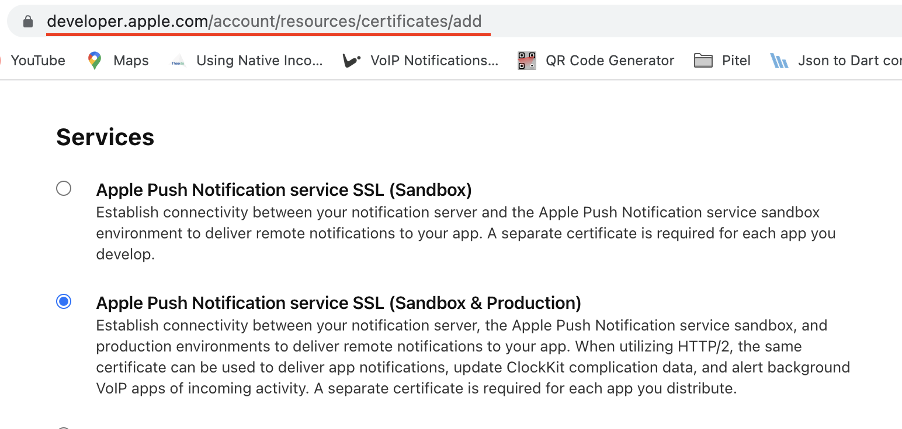
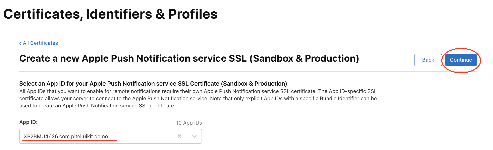
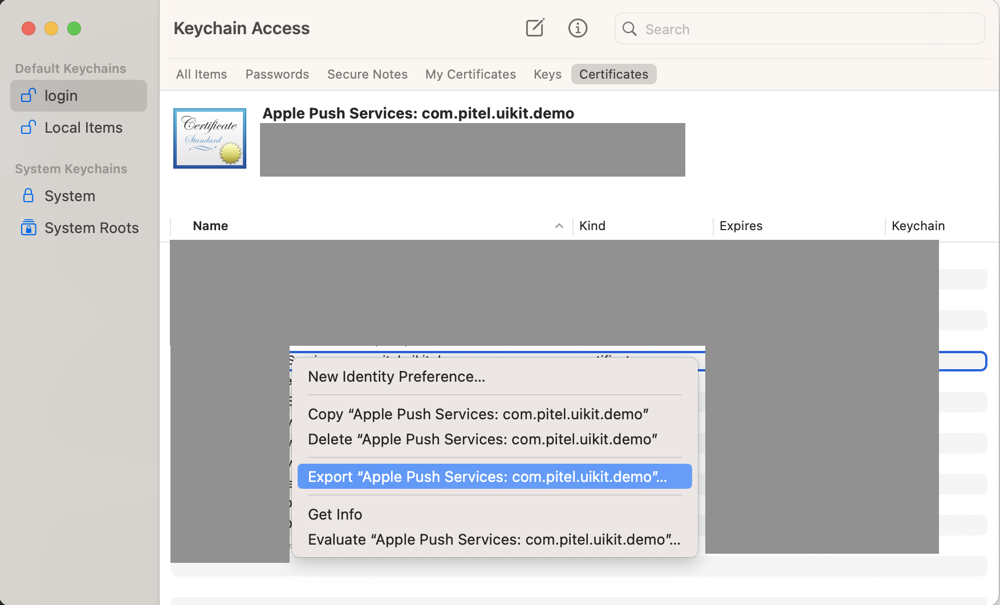
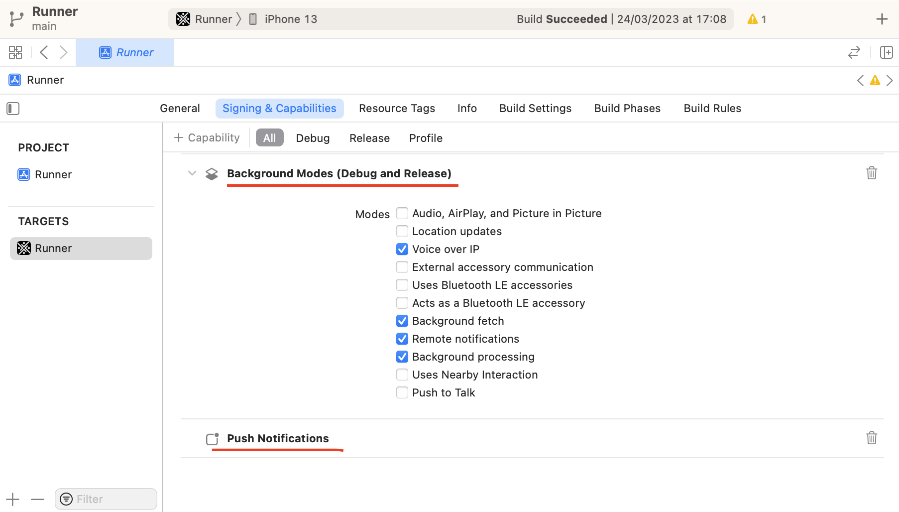
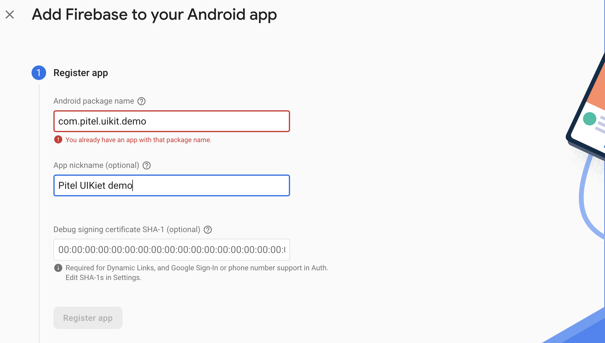
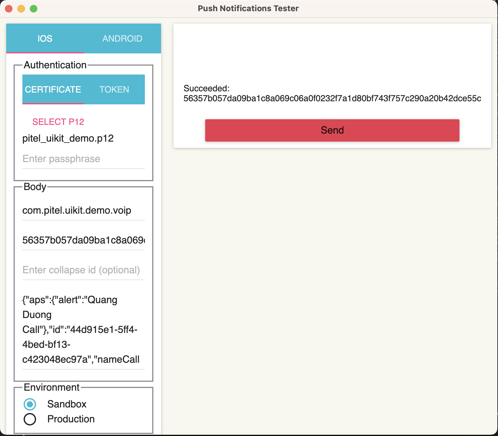

# Pitel Voip Push notification

> **Warning**
> IOS only working on real device, not on simulator (Callkit framework not working on simulator)

# Setup & Certificate

#### IOS

If you are making VoIP application than you definitely want to update your application in the background & terminate state as well as wake your application when any VoIP call is being received.

**1. Create Apple Push Notification certificate.**

- Access [https://developer.apple.com/account/resources/identifiers/list](https://developer.apple.com/account/resources/identifiers/list)
- In [Certificates, Identifiers & Profiles](https://developer.apple.com/account/resources), click Certificates in the sidebar.
- On the top left, click the add button (+).The certificate type should be Apple Push Notification service SSL (Sandbox & Production) under Services.



**2. Choose an App ID from the pop-up menu, then click Continue.**


**3. Upload Certificate Signing Request → Continue**


Follow the instructions to [create a certificate signing request](https://developer.apple.com/help/account/create-certificates/create-a-certificate-signing-request).

- **Install certificate.**
  Download the certificate and install it into the Keychain Access app(download .cer and double click to install).
- **Export the .p12 file and send it to Tel4vn (or using test)**
  

# Setup Pushkit & Callkit

#### IOS

- Open Xcode Project → Capabilities
- In Tab Signing & Capabilities. Enable Push notifications & Background Modes



#### Android

Using FCM (Firebase Cloud Message) to handle push notification wake up app when app run on Background or Terminate

> **Warning**
> Popup request permission only working with targetSdkVersion >= 33

- Access link [https://console.firebase.google.com/u/0/project/\_/notification](https://console.firebase.google.com/u/0/project/_/notification)
- Create your packageId for android app
  
- Download & copy file google_service.json -> replace file google_service.json in path: `android/app/google_service.json`

- Go to Project Setting → Cloud Messaging → Enable Cloud Messaging API (Legacy)
  

> **Note**
> After complete all step Setup. Please send information to dev of Tel4vn, about:
>
> - Bunlde/package Id: example com.company.app
> - File certificate .p12 for IOS.
> - Server key for Android

# Installation (your project)

**Config your project**

- IOS
  In ios/${YOUR_PROJECT_NAME}/Info.plist

```xml
<key>UIBackgroundModes</key>
<array>
    <string>fetch</string>
	<string>processing</string>
	<string>remote-notification</string>
	<string>voip</string>
</array>
```

Replace your file ios/${YOUR_PROJECT_NAME}/AppDelegate.mm with
[AppDelegate](https://github.com/anhquangmobile/rn-pitel-demo/blob/main/ios/rn_pitel_demo/AppDelegate.mm)

## How to test

- Download & install app from link https://github.com/onmyway133/PushNotifications/releases


- Fill information and click Send to Test Push Notification

Note: Add .voip after your bundleId to send voip push notification

Example:

```
Your app bundleId: com.pitel.uikit.demo
Voip push Bundle Id: com.pitel.uikit.demo.voip
```

- IOS



- Android: using above app or test from Postman

cURL

```dart
curl --location 'https://fcm.googleapis.com/fcm/send' \
--header 'Content-Type: application/json' \
--header 'Authorization: key=${server_key}' \
--data '{
    "registration_ids": [${device_token}],
    "data":{
        "uuid": "call_id",
        "nameCaller": "Anh Quang",
        "avatar": "Anh Quang",
        "phoneNumber": "0341111111",
        "appName": "Pitel Connnect"
    },
    "content_available": true,
    "priority": "high"
}'
```
