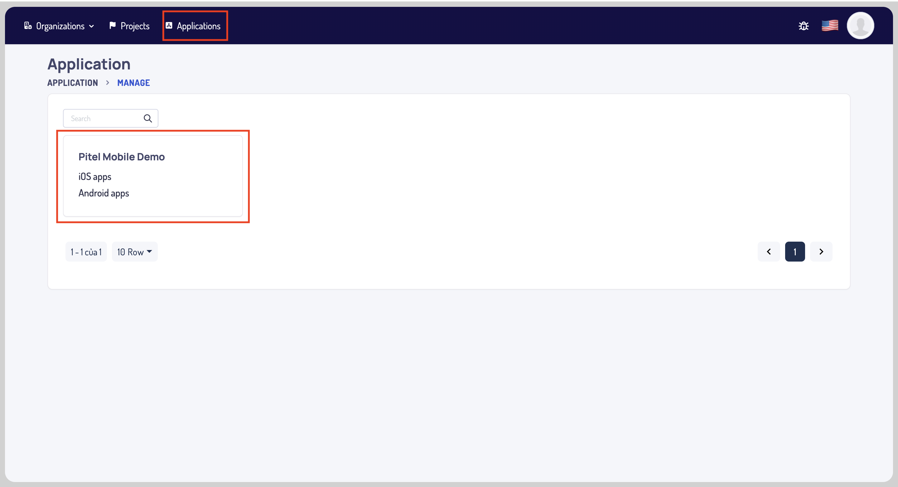
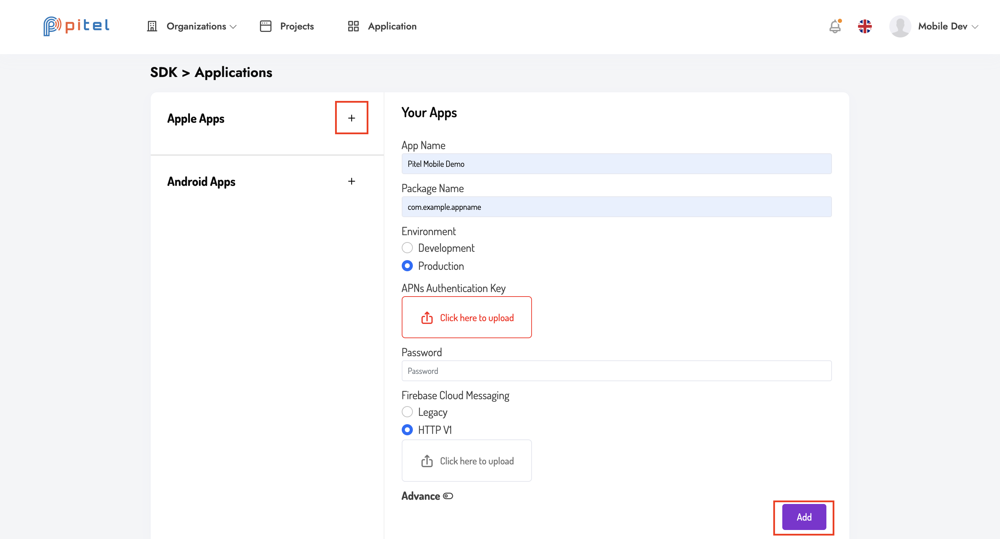
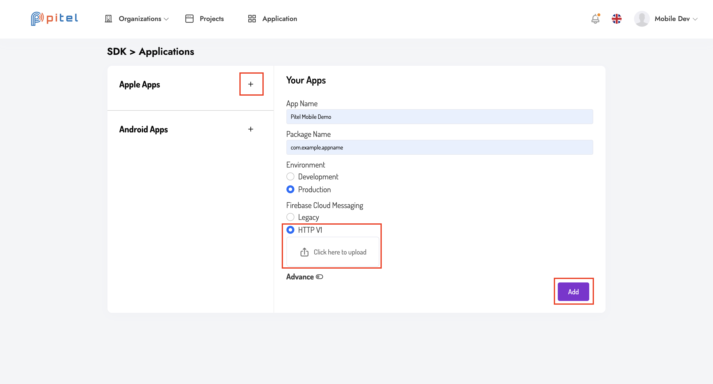

# Guide for Pitel web portal.

### Create new account.

Please access link [portal-sdk](https://portal-sdk.tel4vn.com/login) and sign up your account.

### Create new project.

- In tab Projects -> click button "Add new".
- Fill in the information including "Project name" & "Description".
  
- Click the "Add" button below.

### Config application.

- In tab Application, select the previously created project.
  
- Click the "Plus icon" button to create new config for IOS & Android.
  
  
- Please fill in the necessary information created in the [push_notification](https://github.com/anhquangmobile/react-native-pitel-voip/blob/main/%20PUSH_NOTIF.md) instructions.
