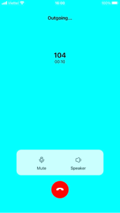
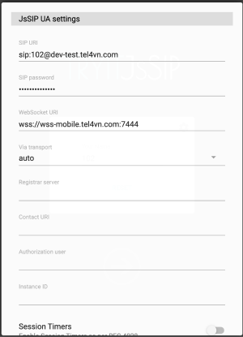

##### react-native-pitel-voip

# Integrate Voip call to your project

[](https://documents.tel4vn.com/)

`react-native-pitel-voip` is package support for voip call. Please contact [pitel](https://www.pitel.vn/)

## Demo




## Pitel Flow

When user make call from Pitel app, Pitel Server pushes a notification for all user login (who receives the call). When user "Accept" call, extension will re-register to receive call.


## Features

- Register Extension
- Call
- Hangup
- Turn on/off micro
- Turn on/of speaker

## Installation

1. Install Packages
   Add pubspec.yaml:

```pubspec.yaml
yarn add react-native-pitel-voip
```

2. Installing dependencies into a bare React Native project

```js
yarn add react-native-callkeep@4.3.9 @react-native-firebase/app@18.1.0 @react-native-firebase/messaging@18.1.0 react-native-background-timer@2.4.1 react-native-get-random-values@1.9.0 react-native-incall-manager@4.1.0 react-native-voip-push-notification@3.3.2 uuid@9.0.0 pitel-react-native-webrtc pitel-sdk-for-rn @react-native-async-storage/async-storage@1.19.1 react-native-permissions@4.0.4
```

3. Pod install

```pubspec.yaml
cd ios
pod install
```

4. Pushkit/ Push notification - Received VoIP and Wake app from Terminated State.
   Note Please check [PUSH_NOTIF.md](https://github.com/anhquangmobile/react-native-pitel-voip/blob/main/%20PUSH_NOTIF.md). setup Pushkit (for IOS), push notification (for Android).

5. Configure Project

#### Android:

- In file `android/app/src/main/AndroidManifest.xml`. [Example](https://github.com/anhquangmobile/react-native-pitel-demo/blob/main/android/app/src/main/AndroidManifest.xml)

```xml
 <manifest...>
    ...
    // Request permission
    <uses-permission android:name="android.permission.INTERNET" />
    <uses-permission android:name="android.permission.SYSTEM_ALERT_WINDOW"/>
    <uses-permission android:name="android.permission.ACCESS_NETWORK_STATE" />
    <uses-permission android:name="android.permission.CAMERA" />
    <uses-permission android:name="android.permission.RECORD_AUDIO" />
    <uses-permission android:name="android.permission.WAKE_LOCK" />
    <uses-permission android:name="android.permission.BLUETOOTH" android:maxSdkVersion="30" />
    <uses-permission android:name="android.permission.BLUETOOTH_CONNECT" />
    <uses-permission android:name="android.permission.MODIFY_AUDIO_SETTINGS" />

    <uses-permission android:name="android.permission.BIND_TELECOM_CONNECTION_SERVICE"/>
    <uses-permission android:name="android.permission.FOREGROUND_SERVICE" />
    <uses-permission android:name="android.permission.READ_PHONE_STATE" />
    <uses-permission android:name="android.permission.CALL_PHONE" />
    <uses-permission android:name="android.permission.READ_CALL_LOG" />

    ...
    // show when lock screen
    <application
    ...
    >
         <service android:name="io.wazo.callkeep.VoiceConnectionService"
        android:label="Wazo"
        android:exported="true"
        android:permission="android.permission.BIND_TELECOM_CONNECTION_SERVICE"
        android:foregroundServiceType="camera|microphone"
        >
            <intent-filter>
                <action android:name="android.telecom.ConnectionService" />
            </intent-filter>
        </service>
        <activity
            ...
            android:showOnLockScreen="true"
            android:showWhenLocked="true"
            android:turnScreenOn="true"
        >
            ...
            <intent-filter>
            <action android:name="android.intent.action.MAIN" />
            <category android:name="android.intent.category.LAUNCHER" />
            </intent-filter>
            <intent-filter>
              <action android:name="android.intent.action.VIEW" />
              <category android:name="android.intent.category.DEFAULT" />
              <category android:name="android.intent.category.BROWSABLE" />
              <data android:scheme="mychat" />
            </intent-filter>
        </activity>
    </application>
 </manifest>
```

- In file `android/gradle.properties`

```
android.useFullClasspathForDexingTransform = true
```

- In file `android/app/build.gradle`.

```
apply plugin: 'com.google.gms.google-services'
```

- In file `android/build.gradle`.

```
buildscript {
    ext {
        ...
        minSdkVersion = 24
        compileSdkVersion = 34
        targetSdkVersion = 34
    }
    ...
    dependencies {
        ...
        classpath 'com.google.gms:google-services:4.3.15'
    }
}
```

#### IOS

- Open Xcode -> Select your project -> Select tab General -> Frameworks, Libraries, and Embedded Content -> Add Callkit.framework
  
- Request permission in file `Info.plist`

```
<key>NSBluetoothAlwaysUsageDescription</key>
<string>Need Bluetooth access for voip call</string>
<key>NSBluetoothPeripheralUsageDescription</key>
<string>Need Bluetooth access for voip call</string>
<key>NSLocationWhenInUseUsageDescription</key>
<string></string>
<key>NSMicrophoneUsageDescription</key>
<string>Need microphone access for voip call</string>
<key>UIBackgroundModes</key>
<array>
	<string>fetch</string>
	<string>processing</string>
	<string>remote-notification</string>
	<string>voip</string>
</array>
```

- Make sure platform ios `12.0` in `Podfile`

```js
# Resolve react_native_pods.rb with node to allow for hoisting
def node_require(script)
  # Resolve script with node to allow for hoisting
  require Pod::Executable.execute_command('node', ['-p',
    "require.resolve(
      '#{script}',
      {paths: [process.argv[1]]},
    )", __dir__]).strip
end

# Use it to require both react-native's and this package's scripts:
node_require('react-native/scripts/react_native_pods.rb')
node_require('react-native-permissions/scripts/setup.rb')

platform :ios, min_ios_version_supported
prepare_react_native_project!

setup_permissions(['Bluetooth'])

linkage = ENV['USE_FRAMEWORKS']
if linkage != nil
  Pod::UI.puts "Configuring Pod with #{linkage}ally linked Frameworks".green
  use_frameworks! :linkage => linkage.to_sym
end

target 'rnpiteldemo' do
  config = use_native_modules!

  pod 'Firebase', :modular_headers => true
  pod 'FirebaseCoreInternal', :modular_headers => true
  pod 'GoogleUtilities', :modular_headers => true
  pod 'FirebaseCore', :modular_headers => true

  use_react_native!(
    :path => config[:reactNativePath],
    # An absolute path to your application root.
    :app_path => "#{Pod::Config.instance.installation_root}/.."
  )

  target 'rnpiteldemoTests' do
    inherit! :complete
    # Pods for testing
  end

  post_install do |installer|
    # https://github.com/facebook/react-native/blob/main/packages/react-native/scripts/react_native_pods.rb#L197-L202
    react_native_post_install(
      installer,
      config[:reactNativePath],
      :mac_catalyst_enabled => false,
      # :ccache_enabled => true
    )
  end
end
```

## Example

Please checkout repo github to get [example](https://github.com/anhquangmobile/react-native-pitel-demo)

## Usage

- In file [index.js](https://github.com/anhquangmobile/react-native-pitel-demo/blob/main/index.js)

```js
import { NotificationBackground } from 'react-native-pitel-voip'; // Add this line
const options = {
  ios: {
    appName: 'app_name',
  },
  android: {
    alertTitle: 'Permissions required',
    alertDescription: 'This application needs to access your phone accounts',
    cancelButton: 'Cancel',
    okButton: 'ok',
    foregroundService: {
      channelId: 'package_id',
      channelName: 'Foreground service for my app',
      notificationTitle: 'My app is running on background',
      notificationIcon: 'Path to the resource icon of the notification',
    },
    additionalPermissions: [],
  },
};

NotificationBackground(options); // Add this line

AppRegistry.registerComponent(appName, () => App);
```

- In file [App.jsx](https://github.com/anhquangmobile/react-native-pitel-demo/blob/main/App.jsx)

```js
// Import this
import { PitelSDKProvider } from 'react-native-pitel-voip';
import BackgroundTimer from 'react-native-background-timer';
import { LogBox } from 'react-native';

LogBox.ignoreAllLogs();
BackgroundTimer.start();

export default function App() {
  return (
    // Wrap your app with PitelSDKProvider
    <PitelSDKProvider>...</PitelSDKProvider>
  );
}
```

- In file `src/screens/home_screen/index.js`
  Please follow [example](https://github.com/anhquangmobile/react-native-pitel-demo/blob/main/src/screens/home_screen/index.js)

> Config sdkOption

```js
const ext = `${EXTENSION}`;
const sipPass = `${EXTENSION_SIP_PASSWORD}`;
const appId = `${BUNDLE_ID}`;
const domainUrl = `${DOMAIN}`;

const sdkOptionsInit = {
  sipDomain: `${DOMAIN}:${PORT}`,
  wssServer: `${WSS_URL}`,
  sipPassword: sipPass,
  bundleId: appId, // Bundle id for IOS
  packageId: appId, // Package id for Android
  teamId: `${TEAM_ID}`, // Team id of Apple developer account
};
```

- Register device token & remove device token

```js
const _registerDeviceToken = async () => {
  const fcmToken = await getFcmToken();
  const deviceToken = Platform.OS == 'android' ? fcmToken : iosPushToken;
  await registerDeviceToken({
    pn_token: deviceToken,
    pn_type: Platform.OS == 'android' ? 'android' : 'ios',
    app_id: appId,
    domain: domainUrl,
    extension: ext,
    app_mode: __DEV__ ? 'dev' : 'production',
    fcm_token: fcmToken,
  });
};

const _removeDeviceToken = async () => {
  const fcmToken = await getFcmToken();
  const deviceToken = Platform.OS == 'android' ? fcmToken : iosPushToken;
  removeDeviceToken({
    pn_token: deviceToken,
    domain: domainUrl,
    extension: ext,
  });
};
```

- Wrap your hone screen component with PitelSDK

```js
return (
  <PitelSDK
    sdkOptionsInit={sdkOptionsInit}
    iosPushToken={iosPushToken}
    setSdkOptions={setSdkOptions}
  >
    <HomeScreenComponent
      navigation={navigation}
      sdkOptions={sdkOptions}
      handleRegisterToken={_registerDeviceToken}
      handleRemoveToken={_removeDeviceToken}
      setIOSPushToken={setIOSPushToken}
    />
  </PitelSDK>
);
```

#### Properties

| Prop           | Description                                     | Type     | Default  |
| -------------- | ----------------------------------------------- | -------- | -------- |
| sdkOptionsInit | your extension info use to login                | Object   | Required |
| iosPushToken   | ios device voip push token                      | String   | Required |
| setSdkOptions  | set sdkOption when your extension login success | Function | Required |

- In file `src/screens/home_screen/home_screen.js`
  [Example](https://github.com/anhquangmobile/react-native-pitel-demo/blob/main/src/screens/home_screen/home_screen.js)

```js
// Register your extension to PBX
const {
  callState,
  receivedPhoneNumber,
  registerState,

  setCallState,
  registerFunc,
} = useRegister({
  sdkOptions: sdkOptions,
  setPitelSDK: setPitelSDK,
  extension: ext,
});

return (
  <PitelCallNotif
    callkitSetup={callkitSetup}
    pitelSDK={pitelSDK}
    setCallState={setCallState}
    callState={callState}
    isLogin={isLogin}
    isCallOut={isCallOut}
    setCallID={setCallID}
    sdkOptions={sdkOptions}
    registerFunc={registerFunc}
    setIsCallOut={setIsCallOut}
    onCreated={handleCreated}
    onReceived={handleReceived}
    onHangup={handleHangup}
    onIOSToken={(iosToken) => {
      setIOSPushToken(iosToken);
    }}
  >
    ...
  </PitelCallNotif>
);
```

#### Properties

| Prop         | Description                                      | Type       | Default  |
| ------------ | ------------------------------------------------ | ---------- | -------- |
| pitelSDK     | pitelSDK get from params of route                | Object     | Required |
| callkitSetup | set information for callkit request permission   | Object     | Required |
| setCallState | set call status                                  | () => void | Required |
| isLogin      | app login/logout status                          | bool       | Required |
| isCallOut    | call direction status                            | bool       | Required |
| setCallID    | set call direction                               | () => void | Required |
| sdkOptions   | received sdkOptions when extension login success | Object     | Required |
| registerFunc | register extension                               | () => void | Required |
| setIsCallOut | set call direction is call out                   | () => void | Required |
| onCreated    | make outgoing call                               | () => void | Required |
| onReceived   | received incoming call                           | () => void | Required |
| onHangup     | set hang up                                      | () => void | Required |
| onIOSToken   | ios voip push notification                       | String     | Required |

- In file `src/screens/call_screen/index.js` [Example](https://github.com/anhquangmobile/react-native-pitel-demo/blob/main/src/screens/call_screen/index.js)

```js
import React, { useState, useContext } from 'react';
import { PitelCallKit, PitelSDKContext } from 'react-native-pitel-voip';

export const CallScreen = ({ route, navigation }) => {
  const [mute, setMute] = useState(false);
  const [speaker, setSpeaker] = useState(false);
  const { pitelSDK } = useContext(PitelSDKContext);

  const { phoneNumber, direction, callState, callID } = route.params;

  return (
    <PitelCallKit
      pitelSDK={pitelSDK}
      callState={callState}
      phoneNumber={phoneNumber}
      direction={direction}
      callID={callID}
      enable={true}
      onHangup={() => {
        pitelSDK.hangup();
      }}
    />
  );
};
```

| Prop      | Description                            | Type     | Default  |
| --------- | -------------------------------------- | -------- | -------- |
| enable    | enable = true to enable call out going | bool     | true     |
| pitelSDK  | pitelSDK when extension login success  | Object   | Required |
| callState | call status                            | String   | Required |
| direction | call direction                         | String   | Required |
| callID    | incoming call id                       | String   | Required |
| onHangup  | hang up when end call                  | Function | Required |

## How to test

Using tryit to test voip call connection & conversation
Link: https://tryit.jssip.net/
Setting:

1. Access to link https://tryit.jssip.net/
2. Enter extension: example 102
3. Click Setting icon
4. Enter information to input field
   
5. Save
6. Click icon -> to connect
